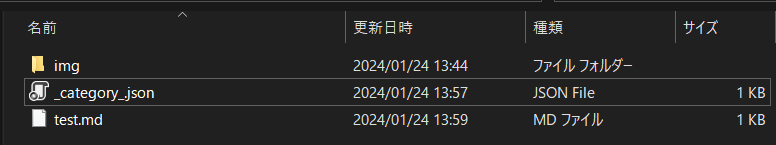
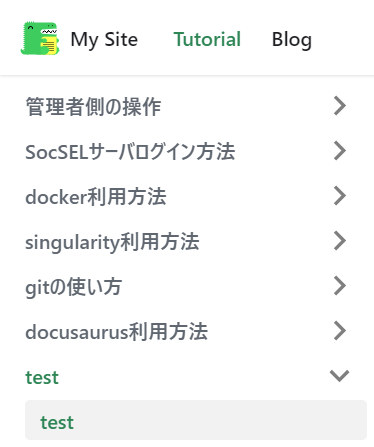

**このページではdocsaurusでページを追加する方法について説明します**
 
## 1.ディレクトリ・ファイルを作る
    - **新しいディレクトリを作り、以下のようにファイルを構成する**
    
    - **`img`：ページに画像を貼る際に使うディレクトリ**
    - **`_category_.json`：カテゴリ名や表示される順序を設定するファイル**
    - **`test.md`：ページの内容が入っているファイル**

## 2.jsonファイルの操作
    - **jsonファイルをテキストエディタで開き、以下の内容で保存する**
        ```bash
        {
        "label": "test",
        "position": 7,
        "link": {
          "type": "generated-index",
          "description": " "
        }
        }
        ```

    - **positionを入れ替えるときは数字の前にスペースを入れないとエラーが出るので注意**
    - **labelにはカテゴリの名称を、positionにはカテゴリがサイドバーの何番目に表示されるかを入れる**
    
    - **ファイル名は"`_category_.json`"で保存すること**

## 3.mdファイルの操作
    - **mdファイルの先頭に以下のような内容を追加する**
        ```bash
        ---
        id: test
        title: test
        sidebar_label: test
        sidebar_position: 1
        ---
        ```
    - **sidebar_labelにはページの名称を、positionにはページがサイドバーの何番目に表示されるかを入れる**
    - **本文をマークダウン記法で記入する**
    **マークダウン記法については以下サイトを参考にするhttps://qiita.com/oreo/items/82183bfbaac69971917f**

## 4.画像の追加
    - **imgフォルダに追加したい画像を入れる**
    - **画像を貼りたい行に以下の内容を追加する**
        ```bash
       
        ```