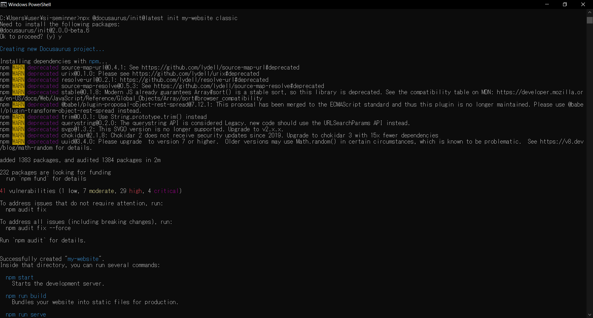
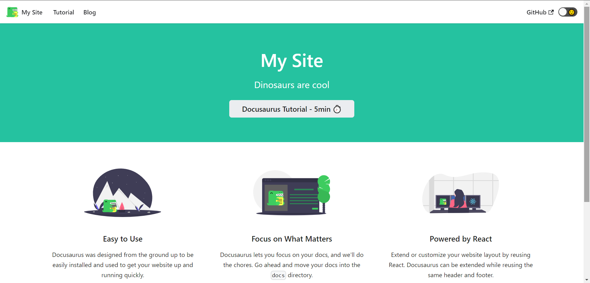

**このページでは、docusaurusの環境構築からローカルで動かす方法までを説明します**

**参考資料**
**https://www.geeklibrary.jp/counter-attack/npx/**
 
## 1.node.jsのインストール
    **https://nodejs.org/en からnode.jsの最新版をインストールする**

## 2.docusaurusのインストール
    - **作業用ディレクトリを作り、そこに移動する**
        ```bash 
        cd [作業用ディレクトリ]
        ```
    - **npmを最新版に更新する**
        ```bash
        npm install -g npm
        ```

    - **docusaurusをインストールする**
        ```bash
        npx @docusaurus/init@latest init [プロジェクト名] classic
        ```
    - **Ok to proceed? (y) と聞かれるので"y"を入力する**
    

    - **３分ほど実行に時間がかかる**
    **Happy building awesome websites!と表示されれば成功**

    - **プロジェクトのディレクトリへ移動**
        ```bash
        cd [作業用ディレクトリ]/[プロジェクト名]
        ```

    - **以下のコマンドを実行するとブラウザが立ち上がる**
        ```bash
        npm start
        ```
    - **以下の画面が出れば成功**
    
