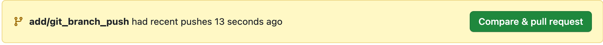

**このページでは、gitでの基本的な操作を学び**


### 作業の始めに行うブランチの切り替え
    - 作業するブランチを作成する
        ```
        git branch ブランチ名
        ```
    - 作成したブランチに移動する
        ```
        git checkout ブランチ名
        ``` 
    - ブランチの切り替え確認する
        ```
        git branch
        ```
    - 作成したブランチ名が緑色なら切り替え完了
### 編集後のcommit~pushの方法
    - 編集したファイルをコミット対象に指定する
        - 編集したファイルを1つ指定する
            ```
            git add ファイル名
            ```
        - 編集したファイルをまとめて指定する
            ```
            git add -A
            ```
    - コミット対象にできているか確認する(緑色:対象　赤色:対象外)
        ```
        git status
        ```
    - コミットメッセージを入力してコミットする
        ```
        git commit -m "コミットメッセージ"
        ```
    - ローカルリポジトリで行った変更をリモートリポジトリに反映させる（push）
        ```
        git push –u origin ブランチ名
        ```
### pushの後のプルリクエストの作成方法
    - githubのpushしたリポジトリに移動する
    - 画面上部に以下のような表示符が出るので，compare & pull requestをクリックする
    
    - タイトルと説明を記入してCreateをクリックしてプルリクエストを作成する
    - コンフリクトが発生していないか確認してマージする

### ローカルのブランチを削除する
    - メインブランチに移動する
        ```
        git checkout main
        ```
    - ローカルのブランチを削除する
        ```
        git branch -d ブランチ名
        ```

### 便利な方法
    - ブランチの作成と切り替えを同時に行える方法
        ```
        git checkout –b ブランチ名
        ```
    - mainブランチで編集をしてしまった時などで作業内容をもどしたいときの対処法
        ```
        git stash
        ```


