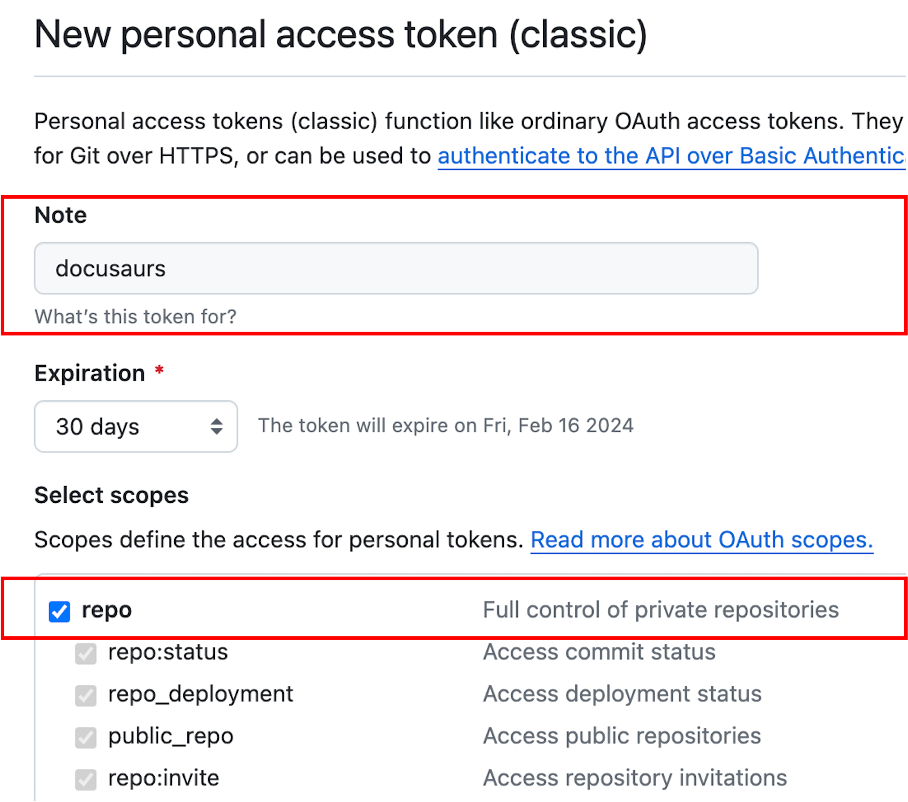
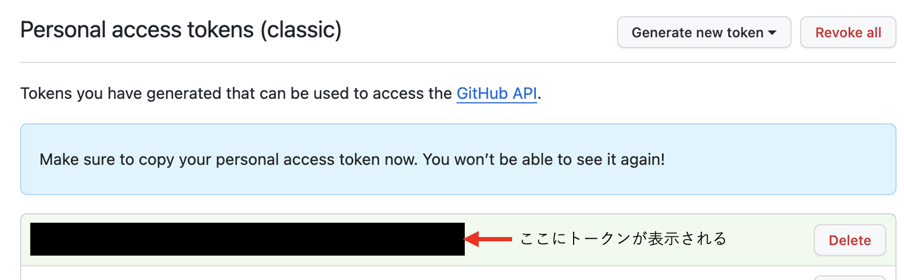

**このページでは、git cloneの実行方法とトークンの作成方法を説明する**


### git cloneの実行方法
    - ターミナルを開く

    - git cloneの実行
        ```
        git clone https://github.com/Wakayama-SocSEL/socusaurus.git
        ```
    - git cloneでユーザ名とパスフレーズの入力を求められた方は，ユーザ名とトークン（パスワードフレーズ）を入力
    - トークンの作成を行っていない人は，下記のトークン作成へ
### トークンの作成
    - トークン作成済みの方は，２に進んでください
    - GitHubのホーム([https://github.com/](https://github.com/))へ移動してログイン

    - 右上の自分のアイコンから歯車マークの「setting」を選択

    - 左のサイドバーの下の方にあるDeveloper Settingsを選択

    - Personal access tokens Token (classic)を選択

    - General new token (classic)を選択

    - 自分のパスワードを入力を入力

    - Noteに目的（目的以外でも良いから何か）を入力し，Select scopesのrepoをクリックしてチェック
     
    - サイトの下の方にあるGenerate tokenをクリックすれば，tokenの作成完了（**注：メモ必須**）
    
