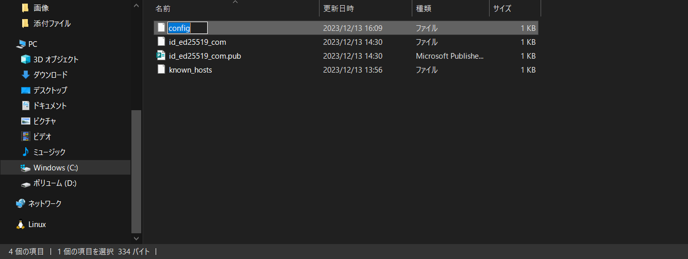

 
### 学外からSocSELサーバにログインする方法
**参考サイト：https://www.wakayama-u.ac.jp/limited/aic/sv/com.html**
 
### 1. 公開鍵・秘密鍵のペアを作成
 
    - 以下のコマンドを入力して、ホームディレクトリに移動
        ```bash
        cd ~/
        ```
    - 以下のコマンドを入力して、ディレクトリを作成
        ```bash
        mkdir .ssh
        ```
    - 以下のコマンドを入力して、キーを作成
        ```bash
        ssh-keygen -t ed25519 -C "com.wakayama-u.ac.jp"
        ```
    - 以下のコマンドを入力して、キーを保存するファイルを作成
        ```bash
        .ssh/id_ed25519_com
        ```
    - パスフレーズを要求されるので、二回入力する。
 
### 2. 作成した公開鍵(.ssh/id_ed25519_com.pub)をcomサーバ上へ転送
 
    - #### mac版
        - 以下のコマンドを入力
            ```bash
            chmod 400 .ssh/id_ed25519_com
            ```
        - 以下のコマンドを入力。Wadai-IDの箇所はs266000のように自分のWadai-IDを入れる 
            ```bash
            ssh-copy-id-i .ssh/id_ed25519_com.pub [Wadai-ID]@com.wakayama-u.ac.jp
            ```
        - "Are you sure you want to continue connecting (yes/no)?" と表示されるので、確認し、"yes"を入力 
        - "[Wadai-ID]@com.wakayama-u.ac.jp's password:"と表示されるので、入学時に配られたパスワード入力 
    - #### windows版
        - 以下のコマンドを**PowerShell**に入力（コマンドプロンプトでは動かないので注意） 
            ```bash
            Set-ItemProperty .ssh/id_ed25519_com -Name IsReadOnly -Value $true
            ```
        - 以下のコマンドを入力。 Wadai-IDの箇所はs266000のように自分のWadai-IDを入れる
            ```bash
            cat .ssh/id_ed25519_com.pub | ssh [Wadai-ID]@com.wakayama-u.ac.jp 'umask 77 && mkdir -p .ssh && cat >> .ssh/authorized_keys
            ```
        -   "[Wadai-ID]@com.wakayama-u.ac.jp's password:"と表示されるので、入学時に配られたパスワード入力 
 
### 3. 接続できるかテスト
    - 以下のコマンドを入力
        ```bash
        ssh [Wadai-ID]@com.wakayama-u.ac.jp -p 9022 -i .ssh/id_ed25519_com
        ```
    - "Enterpassphrase for key '.ssh/id_ed25519_com':"と表示されるので、設定したパスフレーズを入力
    - "[Wadai-ID]@com.wakayama-u.ac.jp's Password:"と表示されるので、入学時に配られたパスワード入力 
 
### 4. 学内からサーバに繋ぐ
    - #### mac版
        - Vimの使い方(https://qiita.com/hide/items/5bfe5b322872c61a6896) 
        - viを開いた状態で「i」を押すと、編集が可能になる。
        - 書き終わったらEscを押して「:wq」と入力する。wが保存,qが終了です
        - 以下のコマンドを入力
            ```bash
            vi .ssh/config
            ```
        - vim内に、以下の3行を入力 
            ```bash
            Host brain-1 

            Hostname 133.42.160.101 

            User ユーザ名 
            ```
    - #### windows版
        - C:\Users\user\.ssh下にテキストファイルを作成 
        - 以下の3行を入力し、適当な名前で保存 
            ```bash
            Host brain-1 
 
            Hostname 133.42.160.101 
 
            User ユーザ名 
            ```
        - ファイル名を編集し、"config"にする(**注：拡張子はなし**)
        